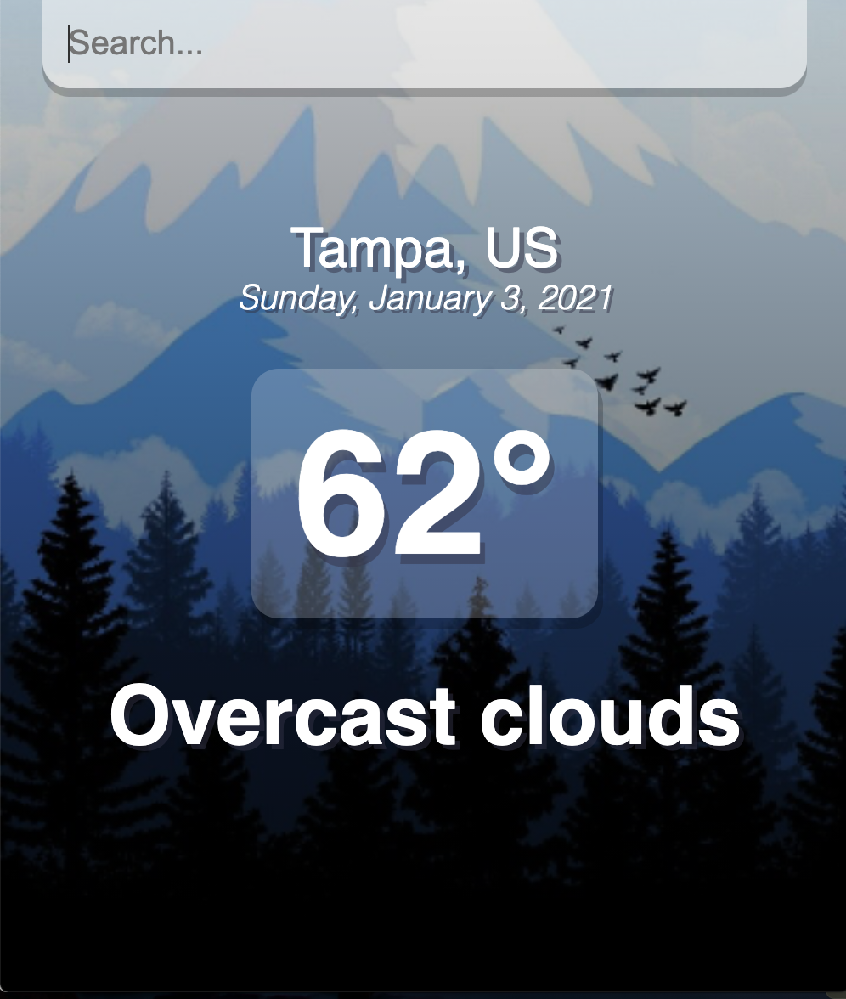
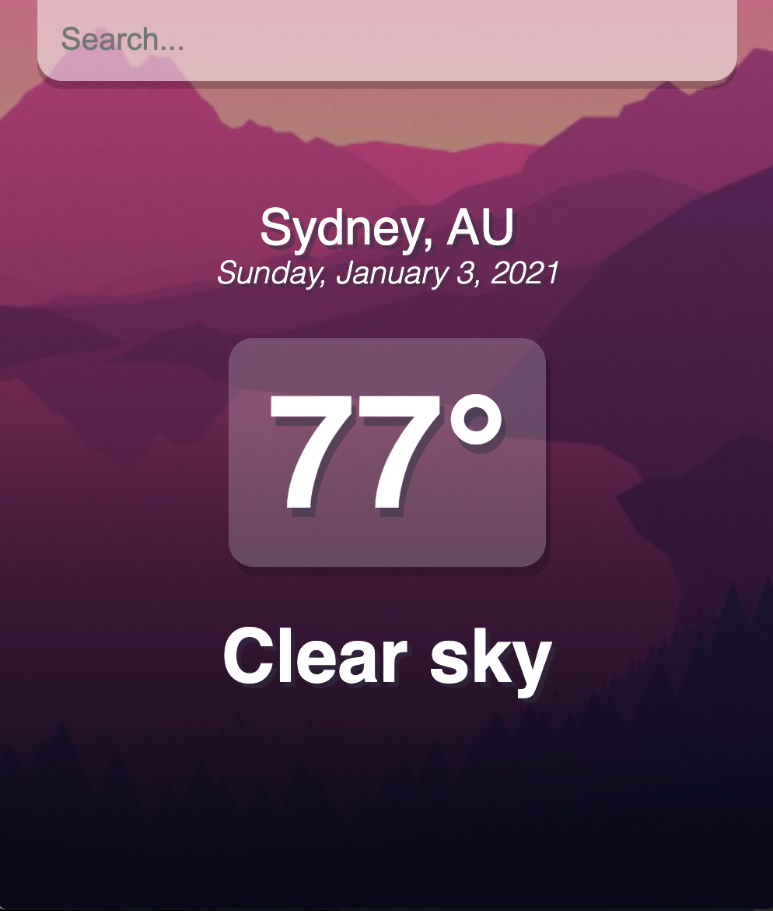

# Weatherly

## Description

Using React, the Weatherly app allows for users to search for the current weather conditions in any city, worldwide.

## Table of Contents

- [Technologies](#technologies)
- [Features](#features)

## Technologies

_Languages_


_API_

- _Open Weather Map API:_ https://openweathermap.org/current

## Features

- Users can search for the current weather conditions for any city, worldwide.
  - The `temperature` and `weather conditions` are displayed
  - If a user searches for a city with current `temperature` above 70°, the background will reflect warm weather, below 70° reflects colder weather.





## Usage

- [Heroku](https://weatherly-dashboard.herokuapp.com/)
- [GitHub](https://github.com/bridgetrshannon/Weather-Dashboard)

```
git clone https://github.com/bridgetrshannon/Weather-Dashboard.git
```
